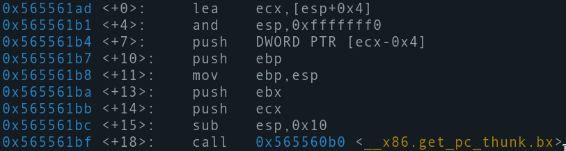

#### Compilation
![[Pasted image 20210218103945.png]]

#### Assembly code
I decided to start with the assembly code cause it'll be more fun.
![[Pasted image 20210218104042.png]]

#### Digestion
This code have some instructions that does the common stuff in weird ways, whatever was the reason for that, they are still the generic things in c functions.

###### First block

---

Explanation: It starts off with some kind of function prologue. Then saves the ECX and EBX because they'll be used by `__x86.get_pc_thunk.bx` which will put an address in EBX that will make us access global stuff like the string that will be using in `printf` later. It reserves 0x10 bytes before calling the function.

---

`lea	ecx, [esp+4]`
Remember that at the top of the stack right now is the **return address** of the function that called main and before that we have **argc** and **argv** on the stack. So `esp+4` is **argc**,  and we're putting that into ECX.

|Current Stack Frame|
|---|
|\*\*argv|
|argc <- ECX|
|Return address <- ESP|

`and	esp, 0xfffffff0`
In GDB I can see that ESP is
![[Pasted image 20210218122309.png]]
so that instruction just `sub	esp, 0xc`

|Current Stack Frame|
|---|
|\*\*argv|
|argc <- ECX|
|Return address|
|...|
|...|
|...  <- ESP|

`push	DWORD PTR [ecx-0x4]`
Pushing the return address again on the stack

|Current Stack Frame|
|---|
|\*\*argv|
|argc <- ECX|
|Return address|
|...|
|...|
|...|
|Return address <- ESP|

`push	ebp`
`mov	ebp, esp`
Basic prologue

|Current Stack|
|---|
|\*\*argv|
|argc <- ECX|
|...|
|...|
|...|
|Return address|
|old_EBP <- ESP <- EBP|

`push	ebx`
`push	ecx`
Since we can find `pop	ebx` and `pop	ecx` down in the code, it's safe to assume they'll be used by the coming functions.

|Current Stack|
|---|
|\*\*argv|
|argc <- ECX|
|...|
|...|
|...|
|Return address|
|old_EBP <- EBP|
|EBX|
|ECX  <- ESP|

`sub	esp, 0x10`
GCC reserves space before function calls I need some explanation, but yeah, basically reserving 0x10 bytes or 4 blocks

|Current Stack Frame|
|---|
|\*\*argv|
|argc <- ECX|
|...|
|...|
|...|
|Return address|
|old_EBP <- EBP|
|EBX|
|ECX|
|...|
|...|
|...|
|... <- ESP|

As you'll see later, the space reserved here will contain the variable defined in the C code.

`call	0x565560b0`
Call `__x86.get_pc_thunk.bx`
EBX will change after the call.

|Current Stack Frame|
|---|
|\*\*argv|
|argc <- ECX|
|...|
|...|
|...|
|Return address|
|old_EBP <- EBP|
|**old_EBX**|
|ECX|
|...|
|...|
|...|
|... <- ESP|

###### Second block
![[Pasted image 20210218125605.png]]

Explanation: EBX now can make us access global data. This block prepares for calling `atoi@plt` to convert **argv[1]** to an integer.

`add	ebx, 0x2e3c` 
I guess this belongs to the previous call or something.

`mov	eax, ecx`
EAX now has the address of **argc**

`mov	eax, DWORD PTR [eax+0x4]`
EAX now contains the value of **\*\*argv**, meaning it's now has a 2d array address. 

`add	eax, 0x4`
EAX now has the address of the pointer-to-string-pointer address. Or basicall **argv[1] address**.

`sub	esp, 0xc`
`push	eax`
Reserving 12 bytes before calling **atoi** then pushing EAX (the pointer to string) as an argument for **atoi**. So it's **ESP -= 0x10**.

|Current Stack Frame|
|---|
|\*\*argv|
|argc <- ECX|
|...|
|...|
|...|
|Return address|
|old_EBP <- EBP|
|old_EBX|
|ECX|
|...|
|...|
|...|
|...|
|...|
|...|
|...|
| EAX (**atoi** argument) <- ESP|

`call	0x56556060`
Calling **atoi**
EAX will now have the integer value of the string we passed to the program.
ECX changes here.

|Current Stack Frame|
|---|
|\*\*argv|
|argc <- ECX|
|...|
|...|
|...|
|Return address|
|old_EBP <- EBP|
|old_EBX|
|**old_ECX**|
|...|
|...|
|...|
|...|
|...|
|...|
|...|
| EAX (**atoi** argument) <- ESP|

###### Third block
![[Pasted image 20210218130902.png]]

Explanation: We start with cleaning the stack after calling **atoi**, then preparing for calling `printf@plt`

`add	esp, 0x10`
Clean up the stack we prepared for **atoi**

|Current Stack Frame|
|---|
|\*\*argv|
|argc <- ECX|
|...|
|...|
|...|
|Return address|
|old_EBP <- EBP|
|old_EBX|
|old_ECX|
|...|
|...|
|...|
|... <- ESP|

`mov	DWORD PTR [ebp-0xc], eax`
Move the value we got from **atoi** to the stack. Sounds like it's the assignment of a local variable. 

|Current Stack Frame|
|---|
|\*\*argv|
|argc <- ECX|
|...|
|...|
|...|
|Return address|
|old_EBP <- EBP|
|old_EBX|
|old_ECX|
| atoi return value (**local variable**)|
|...|
|...|
|... <- ESP|

`sub	esp, 0x8`
Reserving 8 bytes before calling **printf**.

|Current Stack Frame|
|---|
|\*\*argv|
|argc <- ECX|
|...|
|...|
|...|
|Return address|
|old_EBP <- EBP|
|old_EBX|
|old_ECX|
| atoi return value (**local variable**)|
|...|
|...|
|...|
|...|
|... <- ESP|

`push	DWORD PTR [ebp-0xc]`
The second argument for **printf** -> local variable

|Current Stack Frame|
|---|
|\*\*argv|
|argc <- ECX|
|...|
|...|
|...|
|Return address|
|old_EBP <- EBP|
|old_EBX|
|old_ECX|
| atoi return value (**local variable**)|
|...|
|...|
|...|
|...|
|...|
|(**local variable**)|

`lea	eax, [ebx-0x1ff8]`
`push	eax`
Noticed something? Yup EBX is used to access the address of a string
![[Pasted image 20210218131705.png]]
Then putting it on the stack

The preparation for calling **printf** subtracted 0x10 from ESP.

|Current Stack Frame|
|---|
|\*\*argv|
|argc <- ECX|
|...|
|...|
|...|
|Return address|
|old_EBP <- EBP|
|old_EBX|
|old_ECX|
| atoi return value (**local variable**)|
|...|
|...|
|...|
|...|
|...|
|(**local variable**)|
|printf string address <- ESP|

###### Final block
![[Pasted image 20210218131858.png]]

As you can see it cleans off the stack we used form **printf** then returning **1** and popping off the values we save earlier then finally exiting main.

#### The C code
![[Pasted image 20210218132230.png]]
